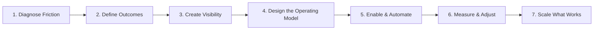

# Transformation Leadership Framework

## From Operating Friction to Sustainable Capability

This framework reflects the recurring approach I have used across program leadership, delivery transformation, PMO modernization, process improvement, and AI enablement work.

It is not tied to a specific methodology. The purpose is to help organizations move from unclear, inconsistent, or high-friction execution toward operating practices that are visible, repeatable, measurable, and sustainable.

---

## The Framework

---

## 1. Diagnose the Friction

Start with the work as it actually happens—not with a preferred methodology or tool.

### Questions I ask
- Where are teams losing time?
- Which decisions are delayed because information is incomplete or inconsistent?
- Where do ownership, priorities, or handoffs break down?
- What work is repeatedly recreated by different people?
- Which problems are symptoms of a larger operating issue?

### Typical outputs
- Problem statement
- Friction and dependency map
- Stakeholder themes
- Initial risk and opportunity list

### Why it matters
Transformation fails when the solution is selected before the operating problem is understood.

---

## 2. Define Outcomes and Decision Needs

Translate the problem into a small set of observable outcomes.

### Questions I ask
- What should be easier, faster, clearer, or more predictable?
- What information do leaders need to make decisions?
- What does success look like for the teams doing the work?
- Which outcomes can be measured without creating unnecessary reporting overhead?

### Typical outputs
- Outcome statements
- Success measures
- Decision requirements
- Ownership and accountability model

### Principle
**Measure the improvement the organization needs—not activity for activity's sake.**

---

## 3. Create Visibility

Before improving a complex system, make the current state visible.

### Techniques I use
- Delivery-health dashboards
- Capacity and workload views
- Risk, dependency, and exception reporting
- Backlog and planning-quality indicators
- Program and portfolio summaries
- Clear source-of-truth definitions

### Why it matters
Teams cannot manage what they cannot see, and leaders cannot make timely tradeoffs without reliable information.

---

## 4. Design the Operating Model

Create enough structure to make execution consistent without forcing every team into an identical process.

### Typical elements
- Planning cadence
- Roles and ownership
- Escalation paths
- Workflow states and conventions
- Intake and prioritization rules
- Risk and dependency management
- Reporting cadence
- Decision points and review mechanisms

### Principle
**Standardize the parts that benefit from consistency; preserve flexibility where the work genuinely differs.**

---

## 5. Enable People and Automate Repeatable Work

A new process is not successful because it was documented. It succeeds when people can use it with confidence.

### Enablement methods I use
- Coaching and practical guidance
- Playbooks and templates
- Onboarding sessions
- Office hours and support channels
- Examples and reusable assets
- Clear documentation

### Where automation fits
I look for repetitive, rules-based, high-friction work that can be improved through automation or AI assistance, including:

- Planning and reporting preparation
- Ticket and documentation quality
- Exception identification
- Data consolidation
- Recurring status analysis
- Workflow guidance

### Principle
**Automation should reinforce a good operating model—not hide a broken one.**

---

## 6. Measure, Learn, and Adjust

Transformation is iterative. Once the new operating model is in use, compare results to the original problem.

### What I examine
- Delivery flow and predictability
- Planning quality
- Capacity and workload alignment
- Adoption and usage
- Recurring exceptions
- Stakeholder feedback
- Reporting consistency
- Areas where manual work or ambiguity remains

### Typical actions
- Adjust workflows
- Simplify standards that are not adding value
- Strengthen weak adoption points
- Improve reporting or decision signals
- Retire practices that no longer serve the outcome

---

## 7. Scale What Works

Once an improvement is producing value, turn it into an organizational capability rather than leaving it as a local success.

### Scaling mechanisms
- Reusable templates and frameworks
- Standard reporting patterns
- Shared documentation
- Training and coaching
- Configurable workflows
- Common dashboards and metrics
- Automation libraries
- Communities of practice and knowledge sharing

### Principle
**A transformation becomes durable when the improved way of working no longer depends on one person remembering how to do it.**

---

## How I Apply the Framework

| Situation | Application |
|---|---|
| **Strategic program leadership** | Clarify outcomes, dependencies, decision points, risk, milestones, and executive visibility |
| **PMO modernization** | Standardize planning, reporting, portfolio visibility, and reusable operating practices |
| **Operational excellence** | Identify friction, reduce process variance, simplify handoffs, and improve measurable execution |
| **Technology transformation** | Coordinate distributed teams, manage dependencies, establish governance, and maintain leadership visibility |
| **AI enablement** | Start with real workflow pain, design repeatable use cases, enable users, maintain human control, and scale adoption |

---

## The Leadership Philosophy Behind It

I bring structure without assuming that more process is always better. The objective is not compliance with a framework. The objective is to create an operating environment where:

- priorities are understandable,
- ownership is visible,
- risks surface early,
- decisions happen with better information,
- teams spend less time on avoidable administrative friction,
- and successful practices can be repeated across the organization.

That is how I define practical transformation.

---

*This framework is a synthesis of leadership practices I have applied across technology program management, delivery operations, PMO improvement, and AI-enabled workflow transformation.*
